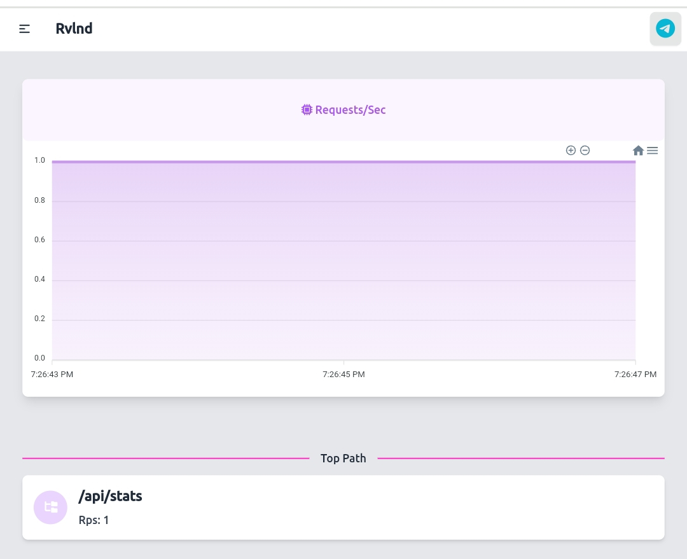

## <center>L7 DSTAT</center>

<div align="center">
  
</div>

## Setup

```bash
   npm install
   ```
To change the Navbar Title on line 38, modify this:
```html
<a class="btn btn-ghost text-xl">Rvlnd</a>
```
to:
```html
<a class="btn btn-ghost text-xl">Your Name</a>
```

To change the Telegram link on line 41, replace this:
```html
<a href="https://t.me/Rvlnddddd" class="btn p-2"><i></i></a>
```
with:
```html
<a href="https://t.me/your_telegram_link" class="btn p-2"><i></i></a>
```

## Run

```bash
node index.js
```

And now ur dstat is ready.
